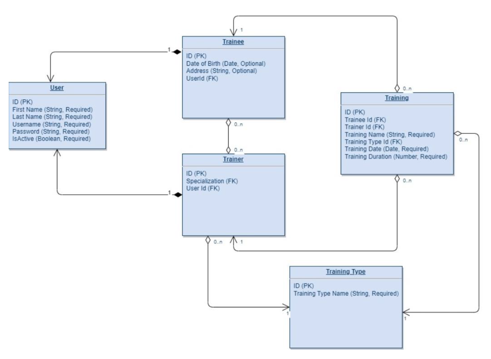

# Gym Spring Boot REST API

A Spring Boot backend application for a Gym CRM system developed as part of the EPAM Java Specialization Program.

The project evolved through three stages:

- Spring Core
- Hibernate / JPA
- Spring Boot REST API

It provides trainee, trainer, and training management through a layered architecture following REST principles and best practices.

---

## Domain Model



### Main Entities

- User
- Trainee
- Trainer
- Training
- TrainingType

### Relationships

- User → Trainee (One-to-One)
- User → Trainer (One-to-One)
- Trainee ↔ Trainer (Many-to-Many)
- Trainer → TrainingType (Many-to-One)
- Training → Trainer (Many-to-One)
- Training → Trainee (Many-to-One)
- Training → TrainingType (Many-to-One)

---

# Features

## Authentication

- Login
- Password change
- Authentication required for all endpoints except registration
- Username/password verification
- Generated username
- Random password generation

---

## Trainee Management

- Register trainee
- Get trainee profile
- Update trainee profile
- Delete trainee profile
- Activate / Deactivate trainee
- Update trainee trainers
- Get trainee trainings
- Get available trainers

---

## Trainer Management

- Register trainer
- Get trainer profile
- Update trainer profile
- Activate / Deactivate trainer
- Get trainer trainings

---

## Training Management

- Add training
- Get trainee trainings
- Get trainer trainings
- Get training types

---

# REST API

The project exposes **17 REST endpoints**.

| Method | Endpoint | Description |
|---------|-----------|-------------|
| POST | /trainees | Register trainee |
| POST | /trainers | Register trainer |
| GET | /login | Login |
| PUT | /login | Change password |
| GET | /trainees/{username} | Get trainee profile |
| PUT | /trainees | Update trainee |
| DELETE | /trainees/{username} | Delete trainee |
| GET | /trainers/{username} | Get trainer profile |
| PUT | /trainers | Update trainer |
| GET | /trainees/{username}/available-trainers | Available trainers |
| PUT | /trainees/trainers | Update trainee trainers |
| GET | /trainees/{username}/trainings | Trainee trainings |
| GET | /trainers/{username}/trainings | Trainer trainings |
| POST | /trainings | Add training |
| PATCH | /trainees/{username}/activation | Activate/Deactivate trainee |
| PATCH | /trainers/{username}/activation | Activate/Deactivate trainer |
| GET | /training-types | Get training types |

---

# Validation

Validation is implemented using Jakarta Bean Validation.

Examples:

- @NotBlank
- @NotNull
- @Size
- @Min
- @Past
- @Valid

---

# Exception Handling

Centralized exception handling using

- `@RestControllerAdvice`
- BaseException
- BaseExceptionHandler
- MethodArgumentNotValidExceptionHandler

Standardized API error responses are returned for:

- Validation errors
- Authentication failures
- Entity not found
- Business exceptions

---

# Logging

Two logging levels are implemented.

### Transaction Logging

- TransactionIdInterceptor
- Generates a unique transaction ID
- Tracks all operations belonging to the same request

### REST Logging

- RestCallLoggingInterceptor
- Logs
    - endpoint
    - request
    - response
    - status code

---

# Swagger Documentation

Swagger 2 annotations are used to document REST endpoints.

- `@Api`
- `@ApiOperation`

---

# Testing

The project includes unit and controller tests.

- JUnit 5
- Mockito
- MockMvc

Tests cover

- Services
- Controllers
- Validation
- Authentication
- Exception handling

---

# Technologies

- Java 21
- Spring Boot
- Spring MVC
- Spring Context
- Hibernate
- JPA
- MySQL
- Maven
- Lombok
- MapStruct
- Jakarta Validation
- Swagger 2
- JUnit 5
- Mockito
- MockMvc

---

# Project Structure

```
controller/
service/
dao/
entity/
dto/
mapper/
config/
exception/
logging/
interceptor/
repository/
```

---

# Highlights

- Layered Architecture
- RESTful API
- DTO Pattern
- Entity Mapping with MapStruct
- Bean Validation
- Global Exception Handling
- Transaction Management
- Authentication
- Cascade Delete
- Logging Interceptors
- Swagger Documentation
- Unit Testing