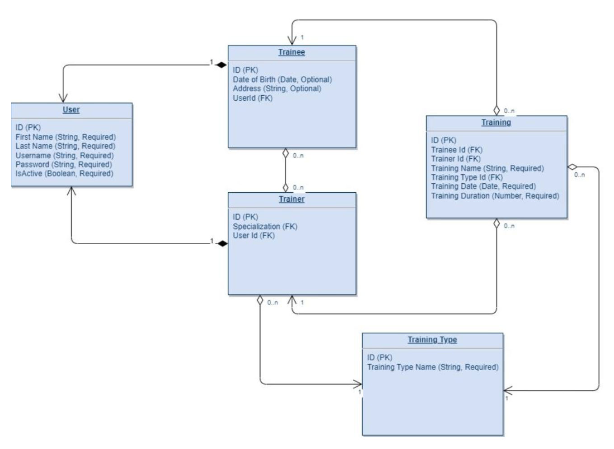

# Gym Spring Boot REST API

A Spring Boot backend application for a Gym CRM system developed as part of the EPAM Java Specialization Program.

The project evolved through four main stages:

* Spring Core
* Hibernate / JPA
* Spring Boot REST API
* Spring Security and Application Monitoring

The application provides trainee, trainer, and training management through a layered architecture while following REST, security, validation, logging, and testing best practices.

---

## Domain Model



### Main Entities

* User
* Trainee
* Trainer
* Training
* TrainingType

### Relationships

* User → Trainee: One-to-One
* User → Trainer: One-to-One
* Trainee ↔ Trainer: Many-to-Many
* Trainer → TrainingType: Many-to-One
* Training → Trainer: Many-to-One
* Training → Trainee: Many-to-One
* Training → TrainingType: Many-to-One

---

# Features

## Authentication and Security

The application uses Spring Security with stateless JWT authentication.

Implemented security features:

* Username and password authentication
* Spring Security `AuthenticationManager`
* Custom `UserDetailsService`
* `DaoAuthenticationProvider`
* BCrypt password hashing
* Automatically generated password salt
* JWT Bearer token authorization
* Stateless session management
* Login functionality
* Logout functionality
* JWT token blacklist
* Password change
* User existence and active-status validation
* Brute-force login protection
* CORS policy configuration
* Role information for trainees and trainers

All business endpoints require authentication except:

* Trainee profile registration
* Trainer profile registration
* Login

### Password Security

Passwords are never stored in plain text.

The application uses:

```text
BCryptPasswordEncoder
```

BCrypt automatically generates a unique salt for every password and stores only the resulting hash in the database.

During trainee or trainer registration:

1. A username is generated.
2. A random password is generated.
3. The plain password is returned only once in the registration response.
4. The BCrypt hash is stored in the database.

### Login

Login is performed through Spring Security using:

* `AuthenticationManager`
* `UsernamePasswordAuthenticationToken`
* `DaoAuthenticationProvider`
* `CustomUserDetailsService`
* `PasswordEncoder`

After successful authentication, the application generates a signed JWT token.

The token must be included in protected requests:

```http
Authorization: Bearer <jwt-token>
```

### Brute-Force Protection

The application protects the login endpoint against repeated password attempts.

Rules:

* Failed login attempts are tracked by username.
* A user is blocked after 3 unsuccessful login attempts.
* The block duration is 5 minutes.
* A successful login clears previous failed attempts.
* Blocked login attempts return `429 Too Many Requests`.

### Logout

The application supports logout for stateless JWT authentication.

When a user logs out:

1. The JWT token is extracted from the Authorization header.
2. Its expiration time is read.
3. The token is added to an in-memory blacklist.
4. Blacklisted tokens are rejected by the JWT authentication filter.
5. Expired blacklist entries are removed automatically.

A logged-out token cannot be used again, even if its original expiration time has not yet been reached.

### CORS

CORS is configured globally through Spring Security.

The current local frontend origin is:

```text
http://localhost:3000
```

Allowed HTTP methods:

* GET
* POST
* PUT
* PATCH
* DELETE
* OPTIONS

Allowed request headers:

* Authorization
* Content-Type

---

## Trainee Management

* Register trainee
* Generate trainee username and password
* Get trainee profile
* Update trainee profile
* Delete trainee profile
* Activate or deactivate trainee
* Update assigned trainers
* Get trainee trainings
* Get available trainers

---

## Trainer Management

* Register trainer
* Generate trainer username and password
* Get trainer profile
* Update trainer profile
* Activate or deactivate trainer
* Get trainer trainings

---

## Training Management

* Add training
* Get trainee trainings
* Get trainer trainings
* Get available training types

---

# REST API

The application exposes REST endpoints under the `/api` base path.

## Authentication Endpoints

| Method | Endpoint      | Authentication | Description                        |
| ------ | ------------- | -------------: | ---------------------------------- |
| POST   | `/api/login`  |         Public | Authenticate user and generate JWT |
| POST   | `/api/logout` |       Required | Logout and blacklist current JWT   |
| PUT    | `/api/login`  |       Required | Change user password               |

## Trainee Endpoints

| Method | Endpoint                                      | Authentication | Description                    |
| ------ | --------------------------------------------- | -------------: | ------------------------------ |
| POST   | `/api/trainees`                               |         Public | Register trainee               |
| GET    | `/api/trainees/{username}`                    |       Required | Get trainee profile            |
| PUT    | `/api/trainees`                               |       Required | Update trainee profile         |
| DELETE | `/api/trainees/{username}`                    |       Required | Delete trainee profile         |
| PATCH  | `/api/trainees/{username}/activation`         |       Required | Activate or deactivate trainee |
| GET    | `/api/trainees/{username}/available-trainers` |       Required | Get available trainers         |
| PUT    | `/api/trainees/trainers`                      |       Required | Update trainee trainers        |
| GET    | `/api/trainees/{username}/trainings`          |       Required | Get trainee trainings          |

## Trainer Endpoints

| Method | Endpoint                              | Authentication | Description                    |
| ------ | ------------------------------------- | -------------: | ------------------------------ |
| POST   | `/api/trainers`                       |         Public | Register trainer               |
| GET    | `/api/trainers/{username}`            |       Required | Get trainer profile            |
| PUT    | `/api/trainers`                       |       Required | Update trainer profile         |
| PATCH  | `/api/trainers/{username}/activation` |       Required | Activate or deactivate trainer |
| GET    | `/api/trainers/{username}/trainings`  |       Required | Get trainer trainings          |

## Training Endpoints

| Method | Endpoint              | Authentication | Description        |
| ------ | --------------------- | -------------: | ------------------ |
| POST   | `/api/trainings`      |       Required | Add training       |
| GET    | `/api/training-types` |       Required | Get training types |

---

# Spring Boot

The application was converted from a traditional Spring application into a Spring Boot application.

Spring Boot provides:

* Automatic configuration
* Embedded Tomcat
* Environment-based configuration
* Actuator endpoints
* Health monitoring
* Metrics integration
* Simplified application startup

The main application is started through:

```java
@SpringBootApplication
public class GymSpringbootApplication {
    public static void main(String[] args) {
        SpringApplication.run(GymSpringbootApplication.class, args);
    }
}
```

---

# Spring Profiles

The project supports multiple runtime environments through Spring profiles:

* `local`
* `dev`
* `stg`
* `prod`

Each environment can have separate settings for:

* Database URL
* Database username
* Database password
* Hibernate configuration
* Logging configuration
* Actuator exposure
* Application-specific properties

Example startup command:

```bash
mvn spring-boot:run -Dspring-boot.run.profiles=local
```

Or:

```bash
java -jar target/gym-springboot.jar --spring.profiles.active=dev
```

When no profile is explicitly selected, the application falls back to the configured default profile.

---

# Actuator

Spring Boot Actuator is enabled for application monitoring.

Available actuator endpoints include:

```text
/actuator/health
/actuator/info
/actuator/prometheus
```

Public monitoring endpoints:

* Health
* Health details
* Application information
* Prometheus metrics

Other actuator endpoints require authentication.

---

# Custom Health Indicators

The project includes custom health indicators for monitoring application components.

Custom health checks provide application-specific information in addition to the default Spring Boot health status.

Health responses can report statuses such as:

```text
UP
DOWN
```

Health information is available through:

```http
GET /actuator/health
```

---

# Metrics and Prometheus

The application includes custom metrics collected through Micrometer and exposed in Prometheus format.

Examples of measured operations include:

* Successful logins
* Failed logins
* Trainee registrations
* Trainer registrations
* Training operations
* Application activity

Prometheus metrics are exposed through:

```http
GET /actuator/prometheus
```

The project uses:

* Micrometer
* Prometheus Meter Registry
* Counters
* Gauges
* Custom application metrics

---

# Validation

Request validation is implemented using Jakarta Bean Validation.

Examples:

* `@NotBlank`
* `@NotNull`
* `@Size`
* `@Min`
* `@Past`
* `@Valid`

Invalid request data produces a standardized validation error response.

---

# Exception Handling

Centralized exception handling is implemented using:

* `@RestControllerAdvice`
* `BaseException`
* `BaseExceptionHandler`
* Method argument validation handling

Standardized API error responses are returned for:

* Validation errors
* Authentication failures
* Temporarily blocked users
* Missing entities
* Invalid JWT tokens
* Invalid Authorization headers
* Business rule violations

Important HTTP responses include:

| Status                  | Usage                                                 |
| ----------------------- | ----------------------------------------------------- |
| `400 Bad Request`       | Invalid request or validation error                   |
| `401 Unauthorized`      | Invalid credentials or JWT                            |
| `404 Not Found`         | Requested entity does not exist                       |
| `429 Too Many Requests` | User temporarily blocked after repeated failed logins |

---

# Logging

The project includes structured request and transaction logging.

## Transaction Logging

`TransactionIdInterceptor`:

* Generates a unique transaction ID
* Adds the ID to the logging context
* Tracks operations belonging to the same request
* Improves debugging across application layers

## REST Call Logging

`RestCallLoggingInterceptor` logs:

* HTTP method
* Endpoint
* Request information
* Response status
* Processing details

Service-level logging is also implemented for important business and security operations.

Sensitive values such as passwords and JWT contents must not be written to logs.

---

# JWT Implementation

JWT tokens are generated and validated using JJWT.

A token contains:

* Subject / username
* Issued-at timestamp
* Expiration timestamp
* Cryptographic signature

JWT tokens expire after the configured validity period.

The authentication filter performs the following steps:

1. Reads the Authorization header.
2. Extracts the Bearer token.
3. Checks whether the token is blacklisted.
4. Validates the token signature.
5. Extracts the username.
6. Loads the user through `UserDetailsService`.
7. Checks whether the user is active.
8. Creates a Spring Security authentication object.
9. Stores authentication in the `SecurityContext`.

---

# Swagger / OpenAPI Documentation

REST endpoints are documented using Springdoc OpenAPI.

Swagger UI is available at:

```text
/swagger-ui/index.html
```

OpenAPI documentation is available at:

```text
/v3/api-docs
```

Endpoint documentation uses annotations such as:

* `@Operation`
* `@SecurityRequirement`

Protected endpoints are documented with Bearer authentication requirements.

Swagger UI can be used to:

1. Register a trainee or trainer.
2. Login with generated credentials.
3. Copy the generated JWT.
4. Authorize Swagger using the Bearer token.
5. Call protected endpoints.
6. Logout and invalidate the token.

---

# Testing

The project includes unit, integration, service, security, and controller tests.

Testing technologies:

* JUnit 5
* Mockito
* AssertJ
* MockMvc
* Spring Test
* JaCoCo

Tests cover:

* Trainee services
* Trainer services
* Training services
* REST controllers
* Request validation
* Exception handling
* Username and password generation
* BCrypt password hashing
* Salt generation behavior
* Spring Security login
* JWT generation and validation
* Invalid and modified JWT rejection
* Brute-force protection
* Temporary login blocking
* Logout and JWT blacklist
* JWT authentication filter
* User roles and active status
* CORS configuration
* Actuator and monitoring-related behavior

Current code coverage:

```text
89%
```

The JaCoCo report is generated at:

```text
target/site/jacoco/index.html
```

Run tests and generate the report with:

```bash
mvn clean verify
```

---

# Technologies

* Java 21
* Spring Boot 3
* Spring Security
* Spring MVC
* Spring Data / JPA
* Hibernate
* Maven
* H2
* MySQL
* JWT / JJWT
* BCrypt
* Micrometer
* Prometheus
* Spring Boot Actuator
* Spring Profiles
* Lombok
* MapStruct
* Jakarta Bean Validation
* Springdoc OpenAPI
* JUnit 5
* Mockito
* AssertJ
* MockMvc
* JaCoCo

---

# Project Structure

```text
src/main/java/com/berruhanedar/app/gym_springboot/
├── config/
├── controller/
├── dao/
├── dto/
├── entity/
├── exception/
├── facade/
├── health/
├── interceptor/
├── mapper/
├── monitoring/
├── security/
├── service/
└── GymSpringbootApplication.java
```

Test structure:

```text
src/test/java/com/berruhanedar/app/gym_springboot/
├── config/
├── controller/
├── security/
└── service/
```

---

# Running the Application

## Requirements

* Java 21 or later
* Maven 3.9 or Maven Wrapper
* MySQL for environments configured to use MySQL

## Run Tests

```bash
mvn clean test
```

## Run Tests and Generate Coverage

```bash
mvn clean verify
```

## Start with Local Profile

```bash
mvn spring-boot:run -Dspring-boot.run.profiles=local
```

## Build Executable JAR

```bash
mvn clean package
```

## Run Executable JAR

```bash
java -jar target/gym-springboot.jar
```

---

# Security Flow

```text
Register Trainer or Trainee
        ↓
Generate username and random password
        ↓
Hash password with BCrypt and unique salt
        ↓
Store only BCrypt hash in database
        ↓
Login using username and plain password
        ↓
Spring Security verifies password hash
        ↓
Generate JWT
        ↓
Send JWT as Bearer token
        ↓
JWT authentication filter validates request
        ↓
Access protected endpoints
        ↓
Logout
        ↓
Add JWT to token blacklist
        ↓
Reject further requests using the same token
```

---

# Highlights

* Layered architecture
* Spring Boot application
* RESTful API
* DTO pattern
* Entity mapping with MapStruct
* Bean Validation
* Global exception handling
* Transaction management
* Spring Security
* BCrypt password hashing and salting
* JWT Bearer authorization
* Brute-force protection
* Temporary account blocking
* JWT logout and blacklist
* CORS configuration
* Role and user-status validation
* Spring profiles
* Actuator monitoring
* Custom health indicators
* Prometheus custom metrics
* Structured logging
* Swagger / OpenAPI documentation
* Unit and integration testing
* 89% code coverage
